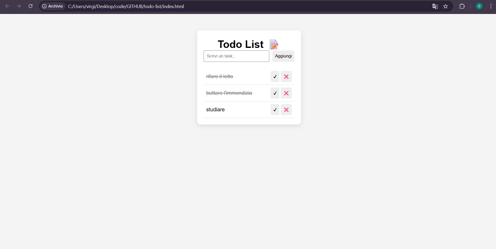

# Todo List App

Una semplice applicazione Todo List sviluppata con HTML, CSS e JavaScript vanilla.

# Live Demo
https://giulia-lazzari.github.io/todo-list/

# Funzionalità

- Aggiunta di nuovi task
- Eliminazione task
- Segnare task come completati
- Salvataggio automatico tramite localStorage
- Interfaccia semplice e responsive

# Tecnologie utilizzate

- HTML5
- CSS3
- JavaScript 
- Git & GitHub
- GitHub Pages

# Obiettivo del progetto

Questo progetto è stato creato per esercitarmi con:
- Manipolazione del DOM
- Gestione dello stato in JavaScript
- Utilizzo del localStorage
- Flusso base di Git (commit, push, repository)

# Screenshot

# Possibili miglioramenti futuri

- Filtri (attivi / completati)
- Editing dei task
- Drag & drop
- Miglioramenti UI/UX
- Versione con framework (es. React)

# Autore

Giulia Lazzari  
GitHub: https://github.com/giulia-lazzari